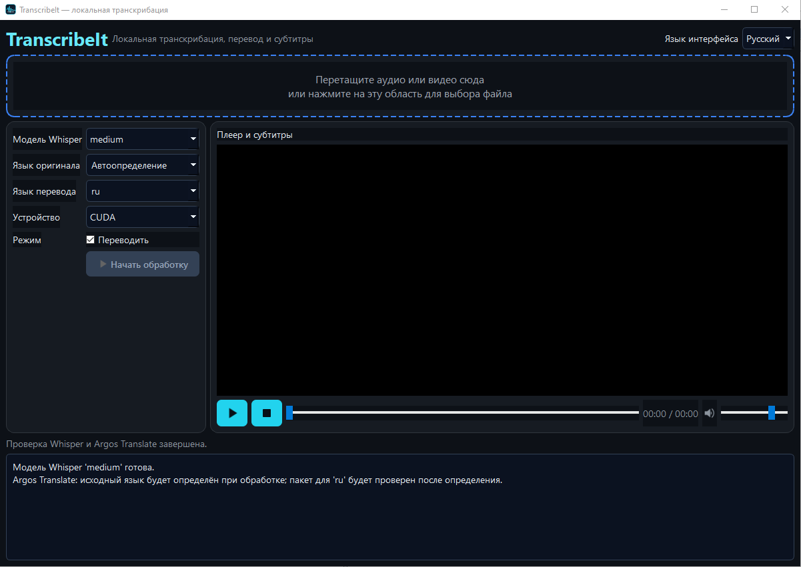

<div align="center">

# TranscribeIt

**Локальная транскрибация, перевод и субтитры для Windows, macOS и Linux**  
**Local transcription, translation, and subtitles for Windows, macOS, and Linux**

[](LICENSE)
[](https://www.python.org/)
[](https://doc.qt.io/qtforpython/)
[](https://github.com/SYSTRAN/faster-whisper)
[](https://github.com/vlad-ir/TranscribeIt/releases)
[](https://github.com/vlad-ir/TranscribeIt/releases)



</div>

## Русский

### О программе

**TranscribeIt** — автономное desktop-приложение для расшифровки аудио и видео, локального перевода и создания субтитров. Приложение использует локальную модель Whisper через `faster-whisper` и локальные языковые пакеты Argos Translate. Аудио, видео, модели, настройки и результаты не отправляются во внешние сервисы; Google Translate и обязательный облачный API не используются.

TranscribeIt предназначен для пользователей, которым нужно получить текст, SRT-субтитры или перевод, сохранив файлы на своём компьютере. Программа поддерживает русский, английский и китайский языки, автоматическое определение языка речи, CPU и CUDA, повторное использование уже созданной расшифровки, drag-and-drop и встроенный плеер.

### Возможности

| Возможность | Описание |
|---|---|
| Локальная транскрибация | Whisper работает внутри локального окружения пользователя |
| Перевод без Google | Argos Translate использует локальные CTranslate2-пакеты |
| Поддержка языков | Русский, английский, китайский и другие пары при наличии Argos-пакета |
| Автоопределение речи | Исходный язык можно определить автоматически или выбрать вручную |
| Модели Whisper | `tiny`, `base`, `small`, `medium`, `large-v3` |
| CPU/CUDA | CUDA выбирается только при наличии рабочего CUDA runtime; иначе используется CPU |
| Повторное использование | При наличии `.original.txt` и `.original.srt` транскрибация пропускается |
| Плеер | Проигрывание аудио/видео, перемотка, громкость и синхронные SRT-субтитры |
| Waveform | Визуальная форма аудиодорожки для аудиофайлов |
| Локализация UI | Переключатель русского и английского интерфейса |
| Портативность | Runtime, модели, настройки и результаты хранятся рядом с приложением |
| Отмена | Текущую обработку можно отменить одной кнопкой |

### Поддерживаемые форматы

PyAV и QtMultimedia позволяют работать с распространёнными аудио- и видеоформатами, включая MP4, MKV, MOV, AVI, WAV, MP3, M4A и другие форматы, поддерживаемые установленными FFmpeg-кодеками. Фактическая поддержка зависит от файла и платформы.

### Быстрая установка для пользователя

Скачайте архив для своей платформы из раздела [Releases](https://github.com/vlad-ir/TranscribeIt/releases) репозитория `TranscribeIt`. Не смешивайте файлы из архивов разных платформ.

| Платформа | Архив | Файл запуска |
|---|---|---|
| Windows 10/11 x64 | `TranscribeIt_windows_*.zip` | `Run_TranscribeIt_Windows.bat` |
| macOS Intel | `TranscribeIt_macos_*.tar.gz` | `Run_TranscribeIt_macOS.command` |
| macOS Apple Silicon | `TranscribeIt_macos_*.tar.gz` | `Run_TranscribeIt_macOS.command` |
| Linux x64/ARM64 | `TranscribeIt_linux_*.tar.gz` | `Run_TranscribeIt_Linux.sh` |

Распакуйте архив в папку, доступную для записи. Не рекомендуется использовать `Program Files`, если приложению нужно сохранять модели и результаты рядом с исходниками. При первом запуске launcher автоматически скачает локальный Miniforge runtime, создаст `.venv`, установит зависимости и проверит мультимедийные библиотеки. Python, Conda, PySide6, Torch или PyInstaller отдельно устанавливать не нужно.

После подготовки окружения программа скачает выбранную модель Whisper и необходимые пакеты Argos Translate. Первый запуск требует интернет-соединения и свободного места; дальнейшая работа с уже скачанными моделями может выполняться локально.

**Windows:** дважды щёлкните `Run_TranscribeIt_Windows.bat`.  
**macOS:** дважды щёлкните `Run_TranscribeIt_macOS.command`; при предупреждении Gatekeeper подтвердите открытие через Finder или `Open`.  
**Linux:** один раз выполните `chmod +x Run_TranscribeIt_Linux.sh`, затем запустите файл.

### Первый запуск и работа с программой

Перетащите аудио- или видеофайл в drop-зону либо щёлкните по ней и выберите файл. Выберите модель Whisper, язык оригинала, язык перевода, CPU/CUDA и режим обработки. Для автоматического определения речи оставьте исходный язык в положении `Автоопределение`.

Нажмите **Начать обработку**. Сначала программа проверит локальные модели. Если готовой исходной расшифровки нет, Whisper создаст `.original.txt` и `.original.srt`. Затем, если перевод включён и исходный язык отличается от целевого, Argos Translate создаст локальный перевод. Во время работы progress-bar показывает этап и прогресс сегментов; кнопку обработки можно использовать для отмены.

После обработки откройте исходный файл в плеере. Для видео субтитры отображаются поверх изображения, для аудио отображается waveform. Плеер поддерживает Play/Pause, Stop, перемотку и громкость.

### Настройки и структура данных

Файл `settings.json` создаётся рядом с запускаемым файлом и хранит выбранную модель, языки, устройство, режим перевода, громкость и язык интерфейса. Личные данные и модели не помещаются в системный профиль пользователя без необходимости.

```text
TranscribeIt/
├── main.py                         # PySide6 interface
├── transcribe_core.py              # transcription and translation logic
├── requirements.txt                # runtime dependencies
├── Run_TranscribeIt_Windows.bat   # Windows launcher
├── Run_TranscribeIt_macOS.command  # macOS launcher
├── Run_TranscribeIt_Linux.sh       # Linux launcher
├── assets/                         # application icons
├── models/
│   ├── whisper/                    # local Whisper models
│   └── argos/                      # local Argos packages
├── output/                         # TXT and SRT results
├── temp/                           # temporary files
├── logs/                           # application logs
├── bin/                            # local multimedia tools, if supplied
├── .runtime/                       # private Miniforge runtime
├── .venv/                          # private Python environment
└── settings.json                   # saved user preferences
```

### Результаты

Для исходного файла `lecture.mp4` результаты находятся в `output/`:

```text
output/lecture.original.txt
output/lecture.original.srt
output/lecture.ru.txt
output/lecture.ru.srt
```

Если перевод выполнялся на другой язык, суффикс будет соответствовать коду целевого языка, например `lecture.en.srt` или `lecture.zh.srt`. Если оба исходных файла существуют, повторная транскрибация не выполняется; программа использует существующие сегменты и создаёт только недостающий перевод.

### Устранение проблем

**Программа просит запустить launcher повторно.** Удалите незавершённые `.runtime` и `.venv` и запустите launcher из новой распакованной папки. Не удаляйте `models` и `output`, если хотите сохранить результаты.

**Ошибка `cublas64_12.dll is not found or cannot be loaded`.** Убедитесь, что используется последняя версия Windows-архива. Launcher устанавливает CUDA-пакеты NVIDIA и добавляет их DLL-каталоги в PATH. Если CUDA runtime или драйвер несовместимы, выберите `CPU`; приложение не должно принудительно использовать CUDA только из-за старого значения в `settings.json`.

**Ошибка PyAV/FFmpeg.** Удалите `.venv` и маркеры `.deps-ready*`, затем запустите launcher снова. Он переустановит бинарный пакет PyAV и выполнит preflight-проверку импорта `av`.

**Перевод не скачивается.** Проверьте интернет, свободное место и выбранную языковую пару. Argos-пакет сохраняется в `models/argos`; после успешной загрузки повторно скачивать его не нужно.

**Обработка на CPU медленная.** Это ожидаемо для больших моделей. Попробуйте `small` или `base`, либо используйте CUDA при наличии рабочего NVIDIA-драйвера и CUDA runtime.

**Программа не запускается после перемещения папки.** Запускайте соответствующий launcher из новой папки. Он использует пути относительно каталога программы и пересоздаёт локальные runtime-пути при необходимости.

### Ручная установка и сборка

Подробное руководство для разработчиков находится в [`docs/DEVELOPER_BUILD_RU_EN.md`](docs/DEVELOPER_BUILD_RU_EN.md). Оно описывает Python 3.10+, виртуальное окружение, установку зависимостей, тесты, ручной запуск, PyInstaller и подготовку portable-каталога.

### Лицензия

Проект распространяется под лицензией MIT. Лицензии и условия сторонних компонентов, включая Whisper/faster-whisper, CTranslate2, Argos Translate, PySide6, PyAV и NVIDIA runtime packages, необходимо учитывать отдельно при распространении сборок.

## Авторы

- **NeiroVlad** ([github.com/vlad-ir](https://github.com/vlad-ir)) — автор портабельной сборки.
- **oti.by** ([t.me/vlad_vlk](https://t.me/vlad_vlk)) — [oti.by](https://oti.by), нейронные сети и умные чат-боты для бизнеса.
- **Нейронки в бизнесе и в жизни** ([t.me/neiro_com](https://t.me/neiro_com)) — промпты, примеры, советы и практические материалы.

## Поддержать автора

Если проект оказался полезным, поставьте ⭐ на [GitHub](https://github.com/vlad-ir/TranscribeIt) и поделитесь репозиторием.

**Карта UnionPay:** `6229644000154242`


**[⬆ Наверх](#transcribeit)**

------


## English

### About

**TranscribeIt** is a local desktop application for speech-to-text transcription, translation, and subtitle generation on Windows, macOS, and Linux. It uses a local Whisper model through `faster-whisper` and local Argos Translate packages. Audio, video, models, settings, and results remain on the user’s computer; Google Translate and mandatory cloud APIs are not used.

TranscribeIt is designed for people who need transcripts, SRT subtitles, or translations without uploading media to an external service. The application supports Russian, English, and Chinese, automatic speech-language detection, CPU and CUDA execution, reuse of existing transcripts, drag-and-drop, and an integrated media player.

### Features

| Feature | Description |
|---|---|
| Local transcription | Whisper runs inside the user’s local runtime |
| Offline-capable translation | Argos Translate uses local CTranslate2 packages |
| Language selection | Russian, English, Chinese, and other available Argos pairs |
| Automatic detection | Detect the speech language or select it manually |
| Whisper models | `tiny`, `base`, `small`, `medium`, `large-v3` |
| CPU/CUDA | CUDA is selected only when its runtime is actually usable; otherwise CPU is used |
| Transcript reuse | Existing `.original.txt` and `.original.srt` files are reused |
| Media player | Audio/video playback, seeking, volume, and synchronized SRT subtitles |
| Waveform | Audio waveform visualization for audio-only files |
| Localized UI | Russian/English interface switcher |
| Portable storage | Runtime, models, settings, and outputs stay beside the application |
| Cancellation | The current job can be cancelled from the processing button |

### Quick installation

Download the archive for your platform from the repository’s [Releases](https://github.com/vlad-ir/TranscribeIt/releases) page. Do not mix files from different platform archives.

| Platform | Archive | Launcher |
|---|---|---|
| Windows 10/11 x64 | `TranscribeIt_windows_*.zip` | `Run_TranscribeIt_Windows.bat` |
| macOS Intel | `TranscribeIt_macos_*.tar.gz` | `Run_TranscribeIt_macOS.command` |
| macOS Apple Silicon | `TranscribeIt_macos_*.tar.gz` | `Run_TranscribeIt_macOS.command` |
| Linux x64/ARM64 | `TranscribeIt_linux_*.tar.gz` | `Run_TranscribeIt_Linux.sh` |

Extract the archive to a writable directory. Avoid `Program Files` if the application must keep models and output files beside its source files. On the first run, the launcher downloads a private Miniforge runtime, creates `.venv`, installs dependencies, and checks the multimedia runtime. Users do not need to install Python, Conda, PySide6, Torch, or PyInstaller separately.

The application downloads the selected Whisper model and required Argos Translate packages on first use. Internet access and free disk space are required during setup; already downloaded components can then be used locally.

**Windows:** double-click `Run_TranscribeIt_Windows.bat`.  
**macOS:** double-click `Run_TranscribeIt_macOS.command`; if Gatekeeper warns you, approve the file through Finder or choose `Open`.  
**Linux:** run `chmod +x Run_TranscribeIt_Linux.sh` once, then launch the script.

### Usage

Drop an audio or video file into the drop zone, or click it to choose a file. Select the Whisper model, source language, target language, CPU/CUDA device, and translation mode. Keep the source language on `Auto-detect` to detect the speech language automatically.

Click **Start processing**. The application first checks local models. If no original transcript exists, Whisper creates `.original.txt` and `.original.srt`. If translation is enabled and the source language differs from the target language, Argos Translate creates a local translation. The determinate progress bar shows the current stage and segment progress; the processing button can cancel the job.

Open the source file in the player after processing. Subtitles are rendered over video, while audio-only files display a waveform. The player supports Play/Pause, Stop, seeking, and volume control.

### Manual development and packaging

See [`docs/DEVELOPER_BUILD_RU_EN.md`](docs/DEVELOPER_BUILD_RU_EN.md) for Python installation, virtual environments, dependencies, tests, manual startup, PyInstaller packaging, and portable directory preparation.


## License

This project is distributed under the MIT License. When redistributing builds, review the licenses and notices of third-party components, including Whisper/faster-whisper, CTranslate2, Argos Translate, PySide6, PyAV, and NVIDIA runtime packages.

## Authors

- **NeiroVlad** ([github.com/vlad-ir](https://github.com/vlad-ir)) — author of the portable build.
- **oti.by** ([t.me/vlad_vlk](https://t.me/vlad_vlk)) — [oti.by](https://oti.by), neural networks and intelligent business chatbots.
- **Neural Networks in Business and Life** ([t.me/neiro_com](https://t.me/neiro_com)) — prompts, examples, and practical advice.

## Support the author

If TranscribeIt is useful to you, please leave a ⭐ on [GitHub](https://github.com/vlad-ir/TranscribeIt) and share the repository.

**UnionPay card:** `6229644000154242`

## References

[1]: https://github.com/SYSTRAN/faster-whisper "faster-whisper"
[2]: https://github.com/argosopentech/argos-translate "Argos Translate"
[3]: https://doc.qt.io/qtforpython/ "Qt for Python / PySide6"
[4]: https://pyav.org/docs/stable/ "PyAV documentation"
[5]: https://docs.conda.io/projects/miniconda/en/latest/ "Conda documentation"
[6]: https://www.pyinstaller.org/ "PyInstaller"

> The repository is maintained at [github.com/vlad-ir/TranscribeIt](https://github.com/vlad-ir/TranscribeIt).

**[⬆ To Top](#transcribeit)**
